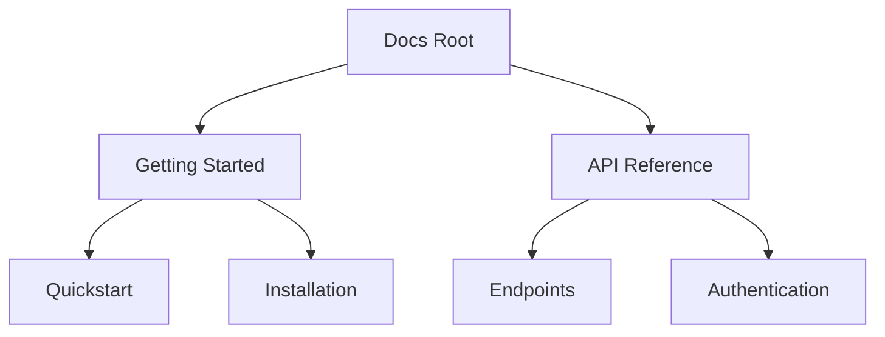

## Overview

Андреев Иван provides essential tools to streamline your documentation workflow. You organize pages into hierarchies, collaborate with teams, search efficiently, and track changes over time. These features ensure your docs stay structured, accessible, and up-to-date.

<Columns cols={3}>
  <Card title="Page Hierarchy" icon="layout" href="#page-organization">
    Build nested structures for intuitive navigation.
  </Card>
  <Card title="Collaboration" icon="users" href="#collaboration">
    Edit and review with your team in real time.
  </Card>
  <Card title="Search & Filters" icon="search" href="#search">
    Find content quickly with advanced options.
  </Card>
</Columns>

## Page Organization and Hierarchy

Create a clear structure using folders and nested pages. You define hierarchies in the sidebar, supporting unlimited nesting for complex projects.



<Steps>
  <Step title="Create Folder" icon="folder">
    Navigate to the root and select `New Folder`.
  </Step>
  <Step title="Add Pages" icon="file-text">
    Inside folders, create child pages with drag-and-drop.
  </Step>
  <Step title="Reorder" icon="move">
    Drag pages to adjust hierarchy visually.
  </Step>
</Steps>

## Collaboration and Editing Tools

Invite team members to co-edit docs. Use real-time cursors, comments, and version locking to avoid conflicts.

<Tabs>
  <Tab title="Invite Collaborators" icon="user-plus">
    <Callout kind="info">
      Share read/write access via email or workspace invites.
    </Callout>

    ```javascript
    // Example: API for inviting users
    const inviteUser = async (email) => {
      const response = await fetch('https://api.example.com/workspaces/invite', {
        method: 'POST',
        headers: { Authorization: `Bearer ${YOUR_API_KEY}` },
        body: JSON.stringify({ email, role: 'editor' })
      });
      return response.json();
    };
    ```
  </Tab>
  <Tab title="Inline Comments" icon="message-circle">
    Highlight text and add `@mentions` for reviews.

    <ParamField path="workspace_id" param-type="string" required="true">
      Your workspace identifier.
    </ParamField>
  </Tab>
</Tabs>

## Search and Filtering Options

Search across all docs with full-text indexing. Filter by tags, authors, or dates for precise results.

| Filter Type | Description | Example |
|-------------|-------------|---------|
| Tags | Match labeled content | `api`, `tutorial` |
| Authors | By contributor | `john.doe@example.com` |
| Date Range | Recent changes | `>2024-01-01` |
| Status | Draft/Published | `published` |

<CodeGroup tabs="Advanced Query,Simple Search">
  ```javascript
  // Advanced search with filters
  const results = await searchDocs({
    query: 'authentication',
    filters: { tags: ['api'], updatedAfter: '2024-01-01' }
  });
  ```
  ```javascript
  // Simple full-text search
  const results = await searchDocs('setup guide');
  ```
</CodeGroup>

<Expandable title="Custom Filters" default-open="false">
  Extend filters via config:

  ```yaml
  search:
    customFilters:
      - name: "priority"
        type: "select"
        options: ["high", "medium", "low"]
  ```
</Expandable>

## Version History and Revisions

Track every change with automatic versioning. Compare diffs, restore previous versions, or branch for experiments.

<Callout kind="tip">
  Enable auto-save to capture revisions every `{5}` minutes.
</Callout>

You view history via the page menu. Revert or cherry-pick changes easily.

<Columns cols={2}>
  <Card title="View Diffs" icon="git-compare" href="#">
    Side-by-side change previews.
  </Card>
  <Card title="Restore Version" icon="refresh-cw" href="#">
    Roll back to any commit.
  </Card>
</Columns>